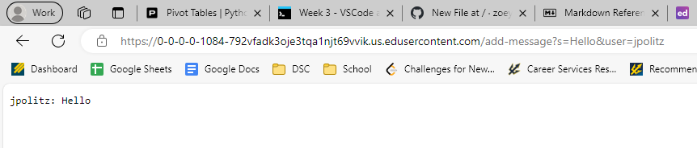
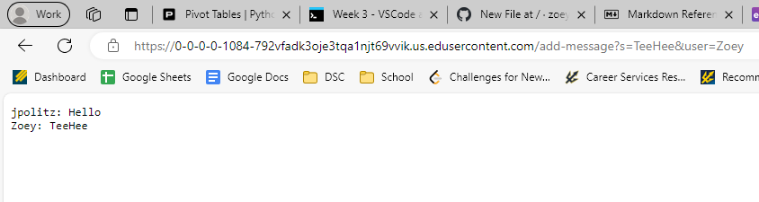
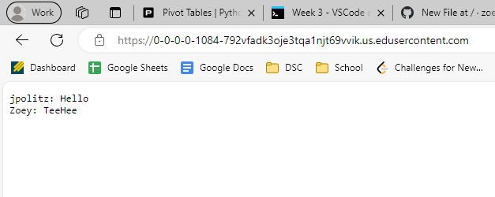

# Codes
```
import java.io.IOException;
import java.net.URI;
import java.util.ArrayList;

class Handler implements URLHandler {
    // The one bit of state on the server: a number that will be manipulated by
    // various requests.
    String user_message = "";
    public String handleRequest(URI url) {
        if (url.getPath().equals("/")) {
            //display current user:message
            return user_message;
        } else {
            if (url.getPath().contains("/add-message")) {
                //[s, How are you&user, yash]
                String[] parameters = url.getQuery().split("=");
                if (parameters[0].equals("s")) {
                    String new_message = parameters[1].split("&")[0];
                    String user = parameters[2];
                    String current_message = String.format("%s: %s\n", user, new_message);
                    user_message = user_message + current_message;
                    return user_message;
                }
            }
            return "404 Not Found!";
        }
    }
}

class ChatServer {
    public static void main(String[] args) throws IOException {
        if(args.length == 0){
            System.out.println("Missing port number! Try any number between 1024 to 49151");
            return;
        }
        int port = Integer.parseInt(args[0]);

        Server.start(port, new Handler());
    }
}
```
## Add Message 1
 
1) In my code, method **handleRequest** of the **Handler** class is called.
2) The relevant arguments are: ```URI url```, the URL object of the request, it is ```"/add-message?s=Hello&user=jpolitz"```. Values of relevant fields of **Handler** class are ```user_message```.
3) ```user_message``` changes everytime add-message is called, before any method is called, it is an empty string. After add-message is called, it is updated with the new user and message ```jpolitz: Hello```.


 
## Add Message 2

1) In my code, method **handleRequest** of the **Handler** class is called.
2) The relevant arguments are: ```URI url```, the URL object of the request, it is ```"/add-message?s=TeeHee&user=Zoey"```. Values of relevant fields of **Handler** class are ```user_message```.
3) ```user_message``` changes everytime add-message is called, before any method is called, it is a string with ```"jpolitz: Hello"```. After add-message is called, it is updated with the new user and message ```Zoey: TeeHee``` which becomes ```"jpolitz: Hello\n Zoey:TeeHee"```.


## Current Page

