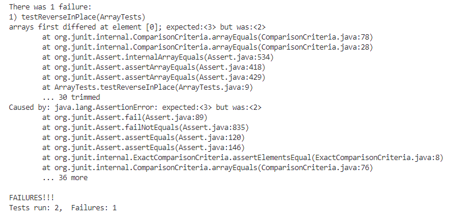

# Lab Report 3
# Part 1
## Bug: reverseInPlace
```
static void reverseInPlace(int[] arr) {
    for(int i = 0; i < arr.length; i += 1) {
      arr[i] = arr[arr.length - i - 1];
    }
  }
```
## correct version:
```
static void reverseInPlace(int[] arr) {
    for (int i = 0; i < arr.length / 2; i++) {
        // Swap elements at i and arr.length - i - 1
        int temp = arr[i];
        arr[i] = arr[arr.length - i - 1];
        arr[arr.length - i - 1] = temp;
    }
}
```
## Failure-inducing
```
public class ArrayTests {
	@Test 
	public void testReverseInPlace() {
    int[] input1 = {1, 2, 3};
    ArrayExamples.reverseInPlace(input1);
    assertArrayEquals(new int[]{3, 2, 1}, input1);
	}
```
## Input that does not induce a failure
```
  @Test 
	public void testReverseInPlace2() {
    int[] input1 = {3};
    ArrayExamples.reverseInPlace(input1);
    assertArrayEquals(new int[]{3}, input1);
	}
}
```
*The symptom of the function reverseInPlace:


*The bug is that the function overwrites the original elements of the array while performing the reversal. To address the bug, modifications need to be made within the for-loop:
* **Before**: The assignment ```arr[i] = arr[arr.length - i - 1]; ```replaces each element with its corresponding element from the reversed position.
```
      for(int i = 0; i < arr.length; i += 1) {
      arr[i] = arr[arr.length - i - 1];
    }
  ```
* **After**: 
```
    for (int i = 0; i < arr.length / 2; i++) {
        int temp = arr[i];
        arr[i] = arr[arr.length - i - 1];
        arr[arr.length - i - 1] = temp;
}
```
* **Explaination**: In this corrected version, a temp variableis used to store the element being swapped, The loop runs only half the length of the array, swapping elements from both ends and moving towards the center. 

# Part 2
## **Find**

1. ```-name```: Searches for files and directories with the specified name.
Example 1:
```
[user@sahara ~]$ cd docsearch/technical/
[user@sahara ~/docsearch/technical]$ find -name 911*
./911report
```
(find all directories and files that names starts with 911)
Example 2:
```
[user@sahara ~/docsearch/technical]$ find ./911report -name "chapter-1.txt"
./911report/chapter-1.txt
```
(find all files that is "chapter-1.txt" within the 911report directory.)
2. ```-type```: Filters results based on the type of file 
Example 1:
```
[user@sahara ~/docsearch/technical]$ find -type d
.
./biomed
./911report
```
(find all type as directories in the current path)
Example 2:
```
[user@sahara ~/docsearch/technical]$ find ./911report -type f
./911report/chapter-8.txt
./911report/chapter-13.3.txt
./911report/chapter-10.txt
./911report/chapter-13.5.txt
./911report/chapter-11.txt
./911report/chapter-7.txt
./911report/chapter-13.4.txt
./911report/chapter-13.2.txt
./911report/chapter-5.txt
./911report/chapter-13.1.txt
./911report/chapter-3.txt
./911report/chapter-2.txt
./911report/chapter-6.txt
./911report/chapter-9.txt
./911report/preface.txt
./911report/chapter-1.txt
./911report/chapter-12.txt
```
(find all type files in the directory 911report directory.)
3. ```-mtime```: Finds files based on their modification time in days.
Example 1:
```
[user@sahara ~/docsearch/technical]$ find -mtime -1 -name "chapter-1.txt"
./911report/chapter-1.txt
```
(to find files modified within the last 1 day and file name as "chapter-1.txt").
Example 2:
```
./911report/chapter-1.txt
[user@sahara ~/docsearch/technical]$ find ./911report -mtime -5
./911report
./911report/chapter-8.txt
./911report/chapter-13.3.txt
./911report/chapter-10.txt
./911report/chapter-13.5.txt
./911report/chapter-11.txt
./911report/chapter-7.txt
./911report/chapter-13.4.txt
./911report/chapter-13.2.txt
./911report/chapter-5.txt
./911report/chapter-13.1.txt
./911report/chapter-3.txt
./911report/chapter-2.txt
./911report/chapter-6.txt
./911report/chapter-9.txt
./911report/preface.txt
./911report/chapter-1.txt
./911report/chapter-12.txt
```
(to find all files modified within the last 5 day within directory 911report).

4. ```-iname```: Allows a case-insensitive search, so it matches files with names like "Pattern.txt" or "PATTERN.txt."
Example 1: 
```
[user@sahara ~/docsearch/technical]$ find -iname "911REPORT"
./911report
```
(find all files and directories contain "911REPORT" where cases doesn't matter)
Example 2:
```
[user@sahara ~/docsearch/technical]$ find ./911report -iname "ChAPteR-1.txt"
./911report/chapter-1.txt
```
(find all files name "ChAPteR-1.txt" in 911report where cases doesn't matter)

## Source Citation
I googled "command line options for find" and read:
https://www.man7.org/linux/man-pages/man1/find.1.html
where I found example of -iname, -type, -name, and -mtime
* I also used ChatGPT:
* my given prompt: Can you explain to me the  command-line options -iname, -type, -name, and -mtime for ```find``` ?
ChatGPT provided examples for me to better interpret the function of them and then I did similar approaches with these command lines in my terminals for the 8 examples which I came up with my own.
* ChatGPT output:
  
```
Certainly! The find command in Unix-like operating systems is a powerful tool for searching and locating files and directories based on various criteria. Here's an explanation of the command-line options you mentioned:

-iname:

Purpose: Case-insensitive name matching.
Usage: find /path/to/search -iname "filename"
This option is used to perform a case-insensitive search for files or directories with a specified name. It is similar to -name, but it ignores the case of the characters in the name.

Example:

bash
Copy code
find /home/user -iname "example.txt"
-type:

Purpose: Specifies the type of the file (regular file, directory, symbolic link, etc.).
Usage: find /path/to/search -type f
This option is used to filter the search results based on the type of file. Common arguments for -type include:

f: Regular file
d: Directory
l: Symbolic link
Example:

bash
Copy code
find /home/user -type d
-name:

Purpose: Case-sensitive name matching.
Usage: find /path/to/search -name "filename"
This option is used to search for files or directories with a specified name in a case-sensitive manner.

Example:

bash
Copy code
find /home/user -name "example.txt"
-mtime:

Purpose: Searches for files based on modification time.
Usage: find /path/to/search -mtime +7
This option is used to find files that were modified more than a certain number of days ago. The argument can be a number (exact days), -n (less than n days ago), +n (more than n days ago).

Example:

bash
Copy code
find /home/user -mtime -7
```
testline

__Since I mainly use ChatGPT for example reference, I used the example codes and modified them to fit into our working directories and files__
* ChatGPT:
```
-iname:
Usage: find /path/to/search -iname "filename
-type:
Usage: find /path/to/search -type f
-mtime:
Usage: find /path/to/search -mtime +7
-name:
Usage: find /path/to/search -name "filename"
```
* My revision:
``` 
[user@sahara ~/docsearch/technical]$ find -iname "911REPORT" 
[user@sahara ~/docsearch/technical]$ find -type d
[user@sahara ~/docsearch/technical]$ find -mtime -1 -name "chapter-1.txt"
[user@sahara ~/docsearch/technical]$ find -name 911*
```
Where I refered to ChatGPT and used a similar format except I change the `filename` and `type.f` to `type.d` and `paths` to search based on my working directories and files.
