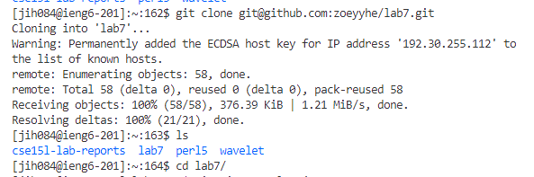
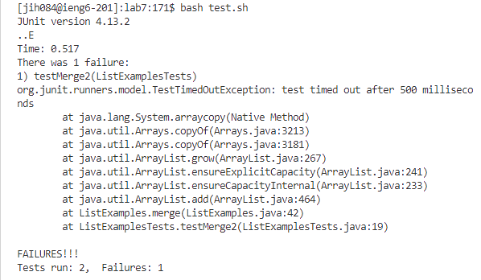
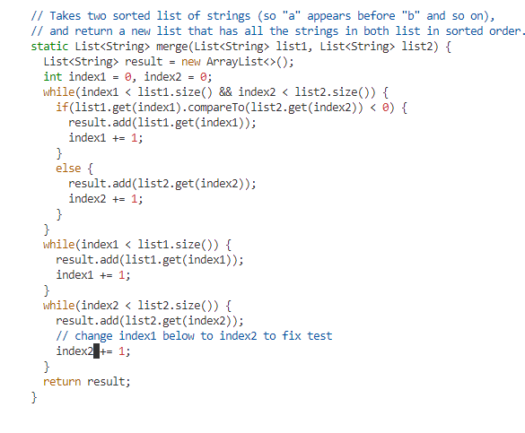
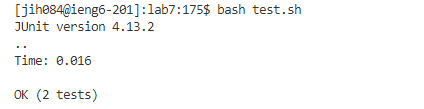
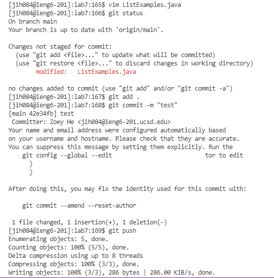

# Lab Report 4 - Vim

Key pressed: 
- `ssh jih084@ieng6-201.ucsd.edu` + `git clone <ssh lab7 url>` + `cd lab7/` #cd to working directory
	

-  `bash test.sh` #complies & run tests

- `cat ListExamples.java` #Check the codes for debug
- `vim ListExamples.java` #Edit file in terminal: `<esc>` + `:44` + `e` + `x` + `i` + `<esc>` + `:wq` #edit save then exit
	

- `<up><up><enter>` to retrive `bash test.sh` #rerun test ensure bug is fixed
	

- `git status` #checks if changes are saved
- `git add . ` #Add changes
- `git commit -m "test"`
- `git push` #push changes to github
	
