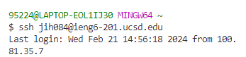

# Lab Report 4 - Vim

1) Step 4: 
- Key pressed: `ssh jih084@ieng6-201.ucsd.edu` + `<ENTER>`
> `ssh` log into ieng6 with my account
	

2) Step 5:

- Key pressed: `git clone <ssh lab7 url>` + `<ENTER>` + `cd lab7/` + `<ENTER>`  #cd to working directory
> `git clone` clones fork of the respository from Github account using 'SSH' URL, `cd` changes current directory to lab7/
	

3) Step 6:
- Key pressed: `bash test.sh` + `<ENTER>`
> `bash` calls the bash file `test.sh` which contains code that complies & run tests, demonstrating that some test has failed

4）Step 7:
- Key pressed: `cat ListExamples.java` + `<ENTER>`
- `vim ListExamples.java`: `<esc>` + `:44` + `e` + `x` + `i` + `2`+ `<esc>` + `:wq`
> `cat` prints the file in terminal to check the codes before debugging
> `vim` enters vim mode to edit file within the terminal
> `:44` goes to line 44 where I found the bug with cat, `e` goes to the last character of the current word, `x` deletes the last character, `i` changes vim mode to insert, where I change  `1` to `2`, after modification is done,  `<esc>` exits the insert mode and `:wq` saves the edit of the file and exit.

	

5) Step 8:
- Key pressed: `<up><up><enter>`
> `<up><up>` with arrow key goes up 2 line of command, to retrive `bash test.sh` in the history so I can rerun test ensure bug is fixed
	

6) Step 9:
- Key pressed: `git status`
>  Checks if changes are saved in the local Git repository.
- `git add . `
> Adds all changes to the staging area, preparing them for a commit.
- `git commit -m "test"`
> Commits the staged changes with a commit message "test" describing the changes made.
- `git push`
> Pushes the committed changes to the remote repository on GitHub
	
