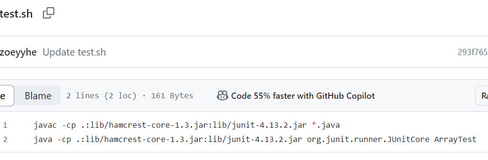

# Lab Report 5: EdStem Post

## Title: Failed test for reverseInPlace
Hi, I wrote a method for reversing a list in place but it failed in tests, can someone help me to understand my error message?
my code:
```
static void reverseInPlace(int[] arr) {
    for(int i = 0; i < arr.length; i += 1) {
      arr[i] = arr[arr.length - i - 1];
    }
  }
```
my test input:
```
public class ArrayTests {
  @Test 
	public void testReverseInPlace() {
    int[] input1 = {1, 2, 3};
    ArrayExamples.reverseInPlace(input1);
    assertArrayEquals(new int[]{3, 2, 1}, input1);
	}
  @Test 
	public void testReverseInPlace2() {
    int[] input2 = {3};
    ArrayExamples.reverseInPlace(input1);
    assertArrayEquals(new int[]{3}, input2);
	}
}
```
My error message: 
	
Thank you!

---

**TA:** 
> Hi there,
> As a hint, I would suggest you to read through the returned messages. Could you try printing the intermediate states of your array inside the loop to see what values are being assigned? This might help you identify the issue.

---

**Student:**
I see! I noticed these are being printed if I added a print statement before `arr[i]` is assigned:
The problem is that I did not store the `arr[i]` for later reassign as swap elements!
```
[1, 2, 3]
[3, 2, 3]
[2, 2, 3]
```
And that the **bug** is that the function overwrites the original elements of the array while performing the reversal, resulting in the output to be different from expected.

---
**TA:** 
> Great! I am glad you found the error, what's your proposed solution?

---
**Student:**
I will mofify my for loop and save my `arr[i]` before it's replaced, also I can shorten the for loop to half as I now modify both end element in one call. Thank you so much for your guidence.

---

4. File & directory needed:
- The contents of each file before fixing the bug:
given in the inital post, `ArrayExamples.java` storing the method, `ArrayTest.java` storing the 2 test cases. And a bash file to store the compile and run file command lines to avoid time spending on typing.

 
	
	

- The full command line to trigger the bug:
`bash test.sh`
- A description of what to edit to fix the bug:
* **Before**: 
```
      for(int i = 0; i < arr.length; i += 1) {
      arr[i] = arr[arr.length - i - 1];
    }
  ```
* **After**: 
```
    for (int i = 0; i < arr.length / 2; i++) {
        int temp = arr[i];
        arr[i] = arr[arr.length - i - 1];
        arr[arr.length - i - 1] = temp;
}
```
* **Description**: To fix the bug, a temp variableis is used to store the element being swapped, The loop runs only half the length of the array, swapping elements from both ends and moving towards the center.

  # Reflection
In CSE15L, I learned how to write in .md files with various format. I learned what is vim and how to exit it. My favorite topic is also vim. I found it challenging to remember all the terminal commands such as wc -l, and the syntax for them. Overall, labs are engaing and fun to participate. The instructions are clear and explanative. I got to meet new friends here while learning new things practical that I didn't get to try in lectures, which is great.

